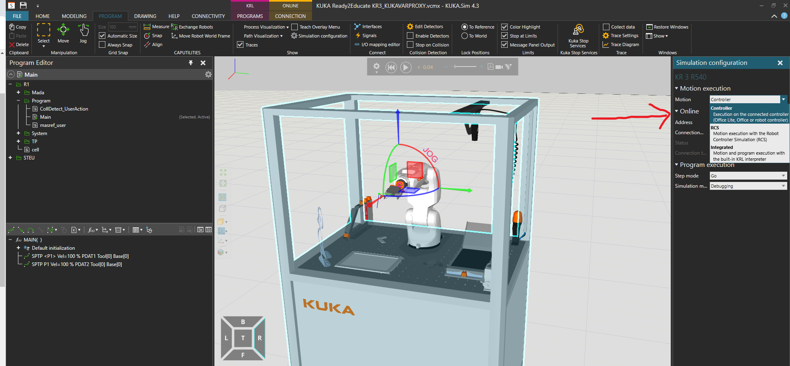
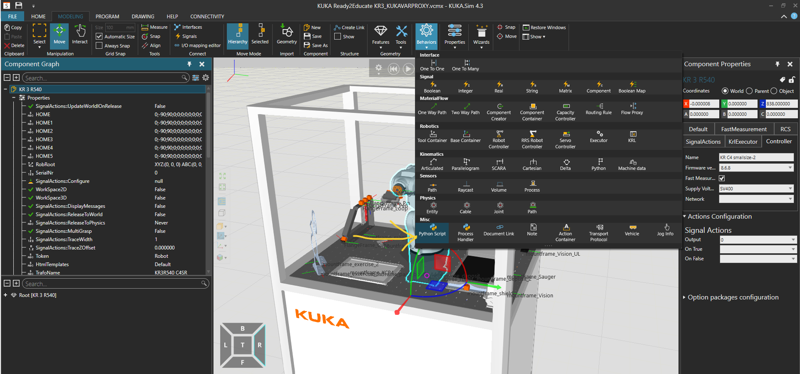

# kukavarproxy_to_kukasim - Fork of py_openshowvar
Python port of KUKAVarProxy client to KUKA SIM - Simple experimental library <br>
Main credits for this work goes to: <br>
a. lmtsSRL [https://github.com/ImtsSrl/KUKAVARPROXY](https://github.com/ImtsSrl/KUKAVARPROXY) for the communication library. <br>
b. linuxsand [https://github.com/linuxsand?tab=repositories](https://github.com/linuxsand?tab=repositories) for compiling the py_openshowvar. <br>
c. rebots [https://www.youtube.com/watch?v=ucBxMxYJqIg&ab_channel=rebots](https://www.youtube.com/watch?v=ucBxMxYJqIg&ab_channel=rebots) for great explanation on the integration tutorial. <br>
# Python Version
Python 2.7 (as KUKA SIM still only support Python 2.7), but can be easily modified for Python3.x. <br>

# Installation Steps for KUKA KRC4 to KUKA SIM
This is an unofficial step to simulate/ have a digital representation of the robot in KUKA SIM.<br>
With newer version of KUKA SIM 4.3x, this repo may be irrelevant!! as you can visualize the robot directly using the option shown below by being connected to the controller.<br>
 

This option directly uses KRC4 controller's KSI option, so no hassle of changing network configuration which will be performed in this repo. I recommend using this option. <br>
##CAUTION: Refer to KUKA Documentation and training for this, as sending program files directly from KUKA SIM to controller and simulating it, may erase your entire robot controller, as the config.dat is modified during this process!!!<br>
Please refer to official documentation from KUKA Support to properly execute this. It is quite straightforward. <br>
However, since we dont follow straight-forward steps, here is the unofficial way !!<br>

## Steps for Real-time visualization using python port
This method follows a round-about way to visualize any program being executed on the KUKA KRC controller in KUKA SIM.<br>
Limited testing has been performed. Follow the documentation at your own risk !!!<br>

### Configuring KLI on KUKA Controller
1. First take a backup image of the KUKA Controller using the KUKA pendrive.<br>
2. Follow the KUKA Official documentation for backing up the controller.<br>
#### Quick steps for backup
a. Plug the KUKA pendrive into you laptop, inside the image folder, copy the contents of the existing backup to your harddisk/laptop. <br>
b. Power-down completely your KUKA robot and controller, plug-in your KUKA pendrive into the KUKA controller and switch-on the KUKA controller. <br>
c. You must notice that the Teach-pendant blacks-out for a moment and switches-off, but the blue-light is blinking on the KUKA pendrive, this means that the backup is in progress. <br>
d. Once backup is completed, the controller automatically turns-off and the pendrive blue-light blinking stops. <br>
e. Power down the robot controller and remove pendrive. <br>
Follow KUKA's official documentation for safe backup!! <br>

#### Configure KLI Network on Robot controller and KUKAVARPROXY installation
Just follow [https://www.youtube.com/watch?v=ucBxMxYJqIg&ab_channel=rebots](https://www.youtube.com/watch?v=ucBxMxYJqIg&ab_channel=rebots) <br>
Best explanation on how to configure KLI and KUKAVARPROXY !<br>

#### Install py_openshowvar
Follow this repo for establishing python communication with the robot. <br>
[https://github.com/linuxsand/py_openshowvar/tree/master](https://github.com/linuxsand/py_openshowvar/tree/master). <br>
Open command prompt with administrative privledges. <br>
```
pip install py-openshowvar
```

#### py_openshowvar for KUKA_SIM
1. Open KUKA SIM
2. Open one of the demo-layout, I have used KUKA Ready2Educate cell as we have that cell at our premise. <br>
3. You should model the simulation of the task, in simulation by yourself of the actual robot cell you have in KUKA SIM. <br>
4. Similar to the picture below, assign a PythonScript to the robot in your simulation. <br>
 
5. Copy the code from __kukasim_py_openshowvar.py__ from this repo to the attached PythonScript. <br>
6. Once this is done, it is straightforward to see the simulation. <br>
7. Script works in all modes - T1, T2 and AUT. But recommend to test it first in T1 mode with reduced speed.
8. Press play in KUKA SIM to see the real-time simulation.
Explanation of the code: Gets the $MY_AXIS position from the robot controller and publishes it to the robot joints for DriveJoints in the KUKA SIM.
Inverse is also possible, where you can send in real-time from KUKA SIM to the controller, which will be updated in the future version after testing. <br>

Working demo based on the deployed script can be found in the link below:
[https://www.youtube.com/watch?v=ki-idtjE6Yo&ab_channel=KeerthiSagar](https://www.youtube.com/watch?v=ki-idtjE6Yo&ab_channel=KeerthiSagar)

__Beware__!! Current implementation only visualizes joint states, KUKA SIM's software in-built has support for joint and also action visualization.


